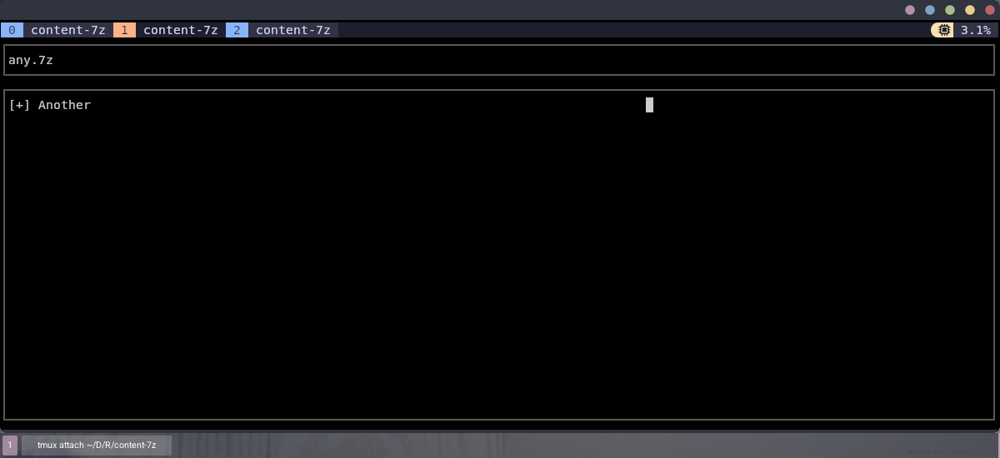

# Content 7z
Tool for visualize the content of a 7z file and navigate around the files, all with a friendly TUI.



## Index
1. [Dependencies](#dependencies)
2. [Usage](#usage)
3. [Installation](#install)
4. [Configurations](#config-file)

## Dependencies
It has 2 important dependencies, rust and the 7z terminal executable.

To download 7z just get it from your package manager, for example:
- Arch like:
```bash
pacman -S p7zip
```
- Ubuntu like:
```bash
apt install p7zip
```
- Termux:
```bash
pkg install p7zip
```

It is similar to get rust just follow their [official guide](https://www.rust-lang.org/es/tools/install) by downloading rustup. Or you can try with your package manager:
- Arch like:
```bash
pacman -S rust
```
- Ubuntu like:
```bash
apt install rust
```
- Termux:
```bash
pkg install rust
```

In the case of termux, it is currently not possible to use the official rustup binary, so it is required to use the package manager.

## Install
Give run permissions to the file "install":
```bash
chmod +x ./install
```

And execute:
```bash
./install
```

It will install the program on the $BIN directory, you can change it how you like:
```bash
BIN=/usr/local ./install
```

That's it, now you have content-7z on your system

## Usage
Type content-7z and a name of a compressed file:
```bash
content-7z any.7z
```

You can move around with 2 keys:
1. Enter, to move into the folder.
2. Backspace, to go back to the parent folder.

The mouse can be move with the arrow keys.
If you want to exit, just press Escape or 'q'.

To open a file, press 'o' while your cursor is over the file to open, it will open in the most specific editor it finds:
- If there is one defined in the configuration file, it will use that one.
- If there is not one defined in the configuration file, it will look to see if the environment variable "EDITOR" is defined, if it is, it will use that editor.
- If none of the above works, it will run the 'editor' binary.

You can try 'content-7z' in the compress_examples folder, with compressed files in different formats.
```bash
cd ./compressed_examples
content-7z any.7z
```

## Config File
The configuration file, using the toml format, is called "content-7z.toml", and is located in "$HOME/.config/content-7z.toml".
A basic configuration file will be created automatically when installing the program.
```toml
# Catppuccine
# background-color = [30, 30, 46]
# text-color = [205, 214, 244]
# border-color = [69, 71, 90]
# Tokio Dark
# background-color = [17, 18, 29]
# text-color = [160, 168, 205]
# border-color = [74, 80, 87]
# Rose pine
# text-color = [224, 222, 244]
# background-color = [25, 23, 36]
# border-color = [110, 106, 134]
# Github Default
# text-color = [230, 237, 243]
# background-color = [13, 17, 23]
# border-color = [110, 118, 129]
# Lunaperche
text-color = [198, 198, 198]
background-color = []
border-color = [88, 88, 88]
editor = ""
```

It has 4 customizable properties, which can be text strings, or rgb colors (defined as a list of 3 numbers) depending on which property it is:
- background color (default: [0, 0, 0, 0])
- text color (default: [200, 200, 200])
- border color (default: [200, 200, 200, 200])
- editor to use (default: "")
